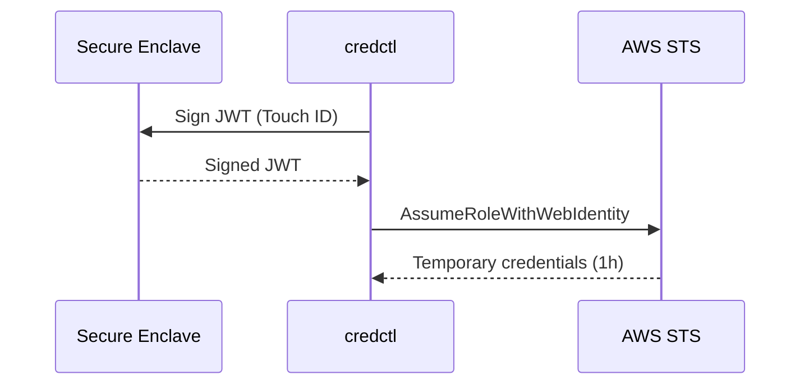

# credctl

**Cloud credentials that can't be stolen.**

credctl uses your Mac's Secure Enclave to create hardware-bound device identities that replace long-lived AWS access keys with short-lived credentials. No plaintext keys on disk. Ever.

```bash
brew install credctl/tap/credctl
```

## How it works



1. **`credctl init`** — generates an ECDSA P-256 key pair in the Secure Enclave. The private key never leaves the hardware.
2. **`credctl setup aws`** — deploys OIDC federation infrastructure via CloudFormation (S3, CloudFront, IAM OIDC provider, IAM role).
3. **`credctl auth`** — signs a JWT with the hardware key and exchanges it for short-lived STS credentials. Touch ID confirms every request.

## Quickstart

```bash
# Install
brew install credctl/tap/credctl

# Create device identity (Touch ID required)
credctl init

# Set up AWS infrastructure (one-time)
credctl setup aws --policy-arn arn:aws:iam::123456789012:policy/MyDevPolicy

# Authenticate
credctl auth --format env
```

See the [full quickstart](https://credctl.com/quickstart) for detailed instructions.

## Credential helper

Add credctl as an AWS credential_process for transparent integration:

```ini
# ~/.aws/config
[profile credctl]
credential_process = credctl auth
```

Then use AWS tools normally:

```bash
AWS_PROFILE=credctl aws s3 ls
```

## Requirements

- macOS with Secure Enclave (Apple Silicon or Intel with T2 chip)
- AWS account
- AWS CLI v2 (for `setup aws` command)

## Documentation

- [Quickstart](https://credctl.com/quickstart)
- [AWS setup guide](https://credctl.com/guides/aws-setup)
- [CLI reference](https://credctl.com/reference/cli/credctl-init)
- [Configuration reference](https://credctl.com/reference/config)
- [Troubleshooting](https://credctl.com/guides/troubleshooting)

## Contributing

See [CONTRIBUTING.md](CONTRIBUTING.md) for build instructions, code signing setup, and contribution guidelines.

## Security

See [SECURITY.md](SECURITY.md) for the vulnerability disclosure policy.

## Licence

Apache 2.0 — see [LICENSE](LICENSE).
