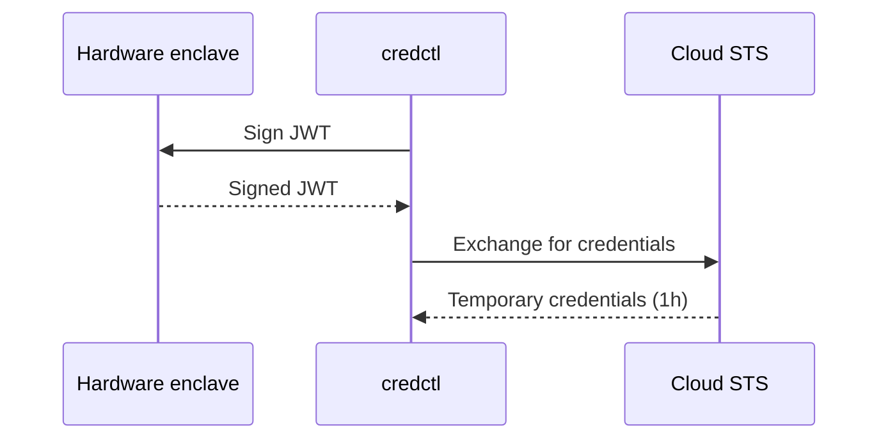

# credctl

**Cloud credentials that can't be stolen.**

credctl uses your machine's hardware security module — Secure Enclave on macOS, TPM 2.0 on Linux — to create hardware-bound device identities that replace long-lived cloud access keys with short-lived credentials. No plaintext keys on disk. Ever.

```bash
brew install credctl/tap/credctl
```

## How it works



1. **`credctl init`** — generates an ECDSA P-256 key pair in the hardware enclave (Secure Enclave on macOS, TPM 2.0 on Linux). The private key never leaves the hardware.
2. **`credctl setup aws`** or **`credctl setup gcp`** — deploys federation infrastructure for your cloud provider.
3. **`credctl auth`** — signs a JWT with the hardware key and exchanges it for short-lived credentials. On macOS, Touch ID confirms each request (configurable via `--biometric`).

## Quickstart

### AWS

```bash
# Install
brew install credctl/tap/credctl

# Create device identity (Touch ID prompt on macOS)
credctl init

# Set up AWS infrastructure (one-time)
credctl setup aws --policy-arn arn:aws:iam::123456789012:policy/MyDevPolicy

# Configure AWS CLI profile
credctl setup aws-profile

# Authenticate
AWS_PROFILE=credctl aws s3 ls
```

### GCP

```bash
# Create device identity (if not already done)
credctl init

# Set up GCP infrastructure (one-time)
credctl setup gcp --service-account credctl@my-project.iam.gserviceaccount.com

# Generate credential config file
credctl setup gcp-cred-file

# Authenticate
export GOOGLE_EXTERNAL_ACCOUNT_ALLOW_EXECUTABLES=1
export GOOGLE_APPLICATION_CREDENTIALS=~/.credctl/gcp-credentials.json
gcloud storage ls
```

See the [full quickstart](https://credctl.com/quickstart) for detailed instructions.

## AWS credential helper

Configure credctl as an AWS credential_process for transparent integration:

```bash
credctl setup aws-profile
```

This writes the `credential_process` entry to `~/.aws/config`. Options:

```bash
credctl setup aws-profile --profile default    # Use as default profile
credctl setup aws-profile --profile myproject   # Custom profile name
credctl setup aws-profile --force               # Overwrite existing profile
```

Then use AWS tools normally:

```bash
AWS_PROFILE=credctl aws s3 ls
```

## GCP credential helper

Generate an external credential config file for GCP client libraries:

```bash
credctl setup gcp-cred-file
```

Then point GCP tools at it:

```bash
export GOOGLE_EXTERNAL_ACCOUNT_ALLOW_EXECUTABLES=1
export GOOGLE_APPLICATION_CREDENTIALS=~/.credctl/gcp-credentials.json
```

Or use with gcloud directly:

```bash
export GOOGLE_EXTERNAL_ACCOUNT_ALLOW_EXECUTABLES=1
gcloud auth login --cred-file=~/.credctl/gcp-credentials.json
```

> **Note:** `GOOGLE_EXTERNAL_ACCOUNT_ALLOW_EXECUTABLES=1` is required by gcloud before it will run executable-sourced credentials. Some gcloud versions (560+) have a known issue with executable-sourced credentials — if you see `KeyError: 'id_token'`, use `gcloud auth login --cred-file` as a workaround, or use GCP client libraries directly which are unaffected.

## CLI reference

```
credctl init                    Create device identity in hardware enclave
credctl status                  Show device identity and configuration
credctl auth                    Get temporary AWS credentials (default)
credctl auth --provider gcp     Get temporary GCP credentials
credctl setup aws               Deploy AWS OIDC federation infrastructure
credctl setup aws-profile       Configure AWS CLI profile
credctl setup gcp               Deploy GCP Workload Identity Federation
credctl setup gcp-cred-file     Generate GCP credential config file
credctl oidc generate           Generate OIDC discovery documents
credctl oidc publish            Upload OIDC documents to S3
credctl version                 Print version information
```

## Infrastructure as code

Terraform modules are available as alternatives to the CLI setup commands:

- [`deploy/terraform/`](deploy/terraform/) — AWS (S3, CloudFront, IAM OIDC, IAM role)
- [`deploy/terraform-gcp/`](deploy/terraform-gcp/) — GCP (Workload Identity Pool, Provider, Service Account)
- [`deploy/cloudformation/`](deploy/cloudformation/) — AWS CloudFormation (used by `credctl setup aws`)

## Requirements

One of:
- **macOS** with Secure Enclave (Apple Silicon or Intel with T2 chip)
- **Linux** with TPM 2.0 (`/dev/tpmrm0`; user in the `tss` group). Tested on Ubuntu 22.04+, Fedora 38+, Amazon Linux 2023.

Plus:
- AWS account and/or GCP project
- AWS CLI v2 (for `setup aws`) or gcloud CLI (for `setup gcp`)

## Documentation

- [Quickstart](https://credctl.com/quickstart)
- [AWS setup guide](https://credctl.com/guides/aws-setup)
- [GCP setup guide](https://credctl.com/guides/gcp-setup)
- [CLI reference](https://credctl.com/reference/cli/credctl-init)
- [Configuration reference](https://credctl.com/reference/config)
- [Troubleshooting](https://credctl.com/guides/troubleshooting)

## Contributing

See [CONTRIBUTING.md](CONTRIBUTING.md) for build instructions, code signing setup, and contribution guidelines.

## Security

See [SECURITY.md](SECURITY.md) for the vulnerability disclosure policy.

## Licence

Apache 2.0 — see [LICENSE](LICENSE).
